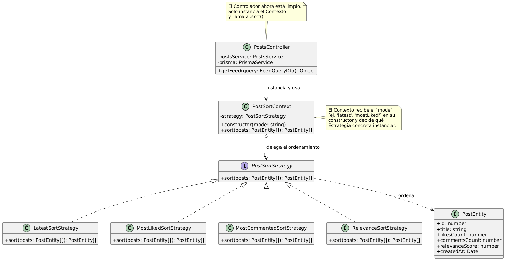
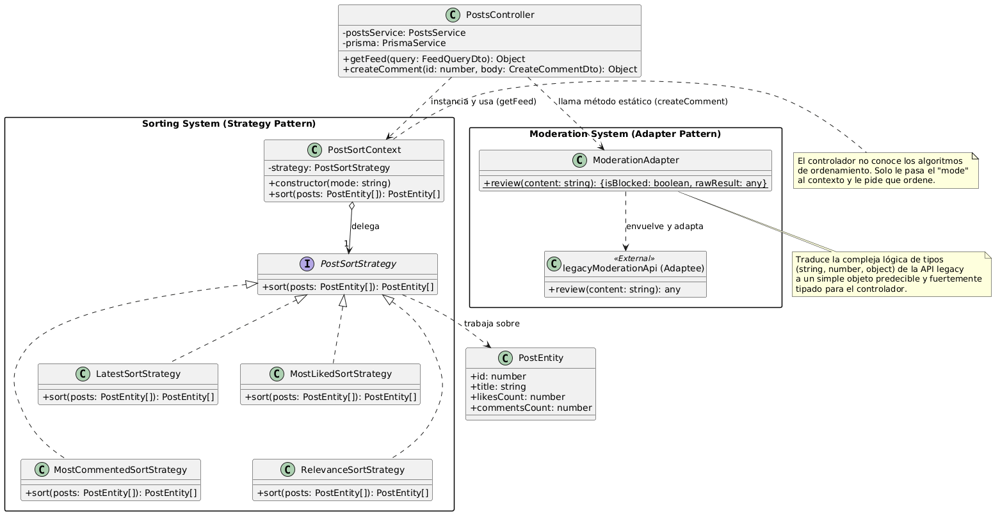

# Reporte de Proyecto: Identificación de Problemas y Soluciones

Este documento detalla el análisis del sistema, los problemas de diseño o implementación identificados en la arquitectura inicial y las soluciones técnicas aplicadas para resolverlos.

## Problemas Identificados

En esta sección se describen las deficiencias, bugs o limitaciones técnicas encontradas en el sistema original.

### ❗️ Problema 1: [Lógica de Ordenamiento y Ranking Inline]
* **Descripción:** [El controlador principal **(posts.controller.ts)** tenía la responsabilidad directa de decidir y ejecutar los algoritmos de ordenamiento para el "feed" de publicaciones a través de una extensa estructura de codigo "switch(mode)"].
* **Impacto:** [El problema violaba fuertemente el Principio de Responsabilidad Única (SRP) y el Principio de Abierto/Cerrado (OCP) de SOLID. Esto provocaba que el controlador estuviera sobrecargado y fuera difícil de leer].

---
### ❗️ Problema 2: [Lógica de Moderación "Legacy" con múltiples tipos]
* **Descripción:** [El controlador principal interactuaba de forma directa con un cliente de moderación externo (legacy) cuyo método de revisión para estos, era inconsistente y terminaba en retornar múltiples tipos de datos distintos (string, number u object), haciendo que obligaba al controlador a implementar múltiples bloques de condicionales encadenados (if / elseif) utilizando el operador "typeof" para descifrar arduamente si un comentario debía ser bloqueado o no].
* **Impacto:** [Esta situación violaba el Principio de Responsabilidad Única (SRP) y generaba un alto nivel de acoplamiento entre estos. La capa de controladores, cuya unica responsabilidad era manejar peticiones y respuestas HTTP, estaba estrechamente ligada a las particularidades y defectos de una librería externa. Si la API legacy llegaba a cambiar sus reglas de retorno, el controlador facilmente se rompería, haciendo que el código fuera muy frágil a la hora del minimo cambio].

---
### ❗️ Problema 3: [Indique nombre del problema...]
* **Descripción:** [Indique descripción del problema...].
* **Impacto:** [Indique el impacto que poseía el problema en el proyecto...].

---
### ❗️ Problema 4: [Indique nombre del problema...]
* **Descripción:** [Indique descripción del problema...].
* **Impacto:** [Indique el impacto que poseía el problema en el proyecto...].

---
### ❗️ Problema 5: [Indique nombre del problema...]
* **Descripción:** [Indique descripción del problema...].
* **Impacto:** [Indique el impacto que poseía el problema en el proyecto...].

---
## Solución Implementada

A continuación se detallan las decisiones de diseño y arquitectura de software tomadas para mitigar los problemas anteriores.

### 🛠 Solución a [Problema 1]
* **Estrategia:** [Se implementó el patrón de diseño Strategy. Para ello, se definió una interfaz común a la que se llamo PostSortStrategy y se extrajo cada algoritmo de ordenamiento del codigo en su propia clase independiente (LatestSortStrategy, MostLikedSortStrategy, MostCommentedSortStrategy, RelevanceSortStrategy). Posteriormente, se creó una clase contexto llamada PostSortContext, encargada de instanciar dinámicamente la estrategia correcta basándose en el filtro (parámetro mode pasado en la petición). Finalmente, en el controlador se reemplazó todo el bloque switch por la simple instanciación del contexto y el llamado a un método genérico .sort()].
* **Justificación:** Se planteo usar este patron porque desacopla completamente la definicion de los algoritmos de ordenamiento del lugar donde se ejecutan (el controlador). Gracias a esto, se cumple el Principio Abierto/Cerrado (OCP): la aplicación ahora está "abierta" a la extensión de nuevas clases, pero "cerrada" a la modificación  Además, se restaura el Principio de Responsabilidad Única (SRP), limpiando el controlador de multiples responsabilidades que podrian hacer fallar el codigo.

  

---
### 🛠 Solución a [Problema 2]
* **Estrategia:** [Se aplicó el patrón de diseño estructural Adapter. Para esto, se creó una nueva clase independiente llamada "ModerationAdapter". Esta clase actúa como un "traductor" o intermediario: envuelve la llamada a la API defectuosa, procesa internamente toda la compleja red de validaciones de "typeof" y expone hacia el exterior una interfaz estandarizada, predecible y fuertemente tipada retornando asi un simple booleano y el resultado original].
* **Justificación:** El patrón Adapter es ideal en esta situacion porque su propósito es permitir que clases o sistemas con interfaces incompatibles trabajen juntos de forma "universal" por asi decirlo. Al usarlo, se logra proteger nuestro controlador "limpio" de la lógica "sucia" del mundo exterior. Además, se cumple con el Principio de Inversión de Dependencias y el Principio de Abierto/Cerrado (OCP) ya que si en un par de meses la API de moderación se actualiza o se llega a cambiar de proveedor, únicamente se deberia de modificar la clase "ModerationAdapter".

  

---
### 🛠 Solución a [Problema 3]
* **Estrategia:** [Indique su solución/estrategia para solucionar el problema...].
* **Justificación:** Indique la razón de esa estrategia como solución al problema...

  

---
### 🛠 Solución a [Problema 4]
* **Estrategia:** [Indique su solución/estrategia para solucionar el problema...].
* **Justificación:** Indique la razón de esa estrategia como solución al problema...

  

---
### 🛠 Solución a [Problema 5]
* **Estrategia:** [Indique su solución/estrategia para solucionar el problema...].
* **Justificación:** Indique la razón de esa estrategia como solución al problema...

  

---